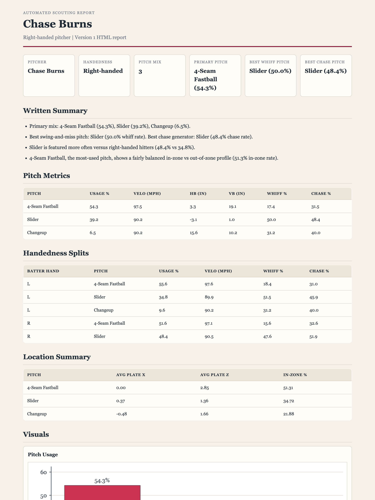

# Automated Baseball Scouting Reports

A reproducible Python pipeline that turns raw MLB **Statcast** pitch data into
polished, front-office-style scouting reports. Type a pitcher's name, get a
self-contained HTML report — metrics, tables, an auto-written summary, and five
charts — in one file.

**🔗 [Live sample report](https://jmaxrod19.github.io/V1-agentic-baseball-scouting/)**



## What it does

- Pulls pitch-level Statcast data for any player and date range (via `pybaseball`).
- **Pitchers:** an **arsenal summary** — usage, velocity, spin, movement (in
  inches, arm-side-positive convention), **whiff** and **chase** rates per pitch
  — plus plate-location and left/right batter splits, with five charts.
- **Hitters:** a **batted-ball-quality** profile — exit velocity, launch angle,
  hard-hit%, barrel%, sweet-spot%, and expected stats on contact
  (**xwOBACON / xBACON**), split vs LHP/RHP.
- Renders a self-contained, offline-viewable HTML report: summary cards, an
  auto-generated narrative, and data tables (one file, prints cleanly to PDF).

## Setup

```bash
python -m venv .venv && source .venv/bin/activate
pip install -r requirements.txt
```

## Generate a report

```bash
# Pitcher HTML report (with charts) -> data/processed/
python scout.py "Chase Burns" --start 2026-06-01 --end 2026-06-28 --html

# Hitter batted-ball-quality report
python scout.py "Ketel Marte" --start 2026-06-01 --end 2026-06-28 --hitter

# Plain-text pitcher report to the terminal
python scout.py "Chase Burns" --start 2026-06-01 --end 2026-06-28
```

Dates default to the current month. Raw pulls are cached in `data/raw/`, so
re-running the same request skips the network.

## Interactive web app

A small FastAPI app (`webapp.py`) serves a form — enter a player, pick
pitcher/hitter and a date range, and get the report rendered live. It reuses the
same pipeline as the CLI (`src/pipeline.py`) but with fast per-player Statcast
pulls, an in-memory cache, and a date-range cap.

```bash
uvicorn webapp:app --reload      # then open http://127.0.0.1:8000
```

**Deploy to Render (free):** New + → Blueprint → pick this repo. Render reads
`render.yaml`, installs deps, and starts the app; every push auto-redeploys. The
free tier sleeps after ~15 min idle (first request then takes ~30s to wake).

## Use the pieces directly

```python
from src import loaders, metrics

df = loaders.load_statcast_csv("data/raw/chase_burns.csv")
arsenal = metrics.pitcher_arsenal(df, pitcher=695505)   # per-pitch-type summary
splits  = metrics.pitcher_handedness_splits(df, pitcher=695505)
```

Each loader returns a clean, typed DataFrame; source-specific quirks are handled
inside `src/loaders.py`.

## Layout

- `scout.py` — the CLI entry point (name in → report out)
- `webapp.py` — the interactive FastAPI web app
- `src/pipeline.py` — shared "name + dates → report" logic (used by CLI + web)
- `src/config.py` — paths and column constants (single source of truth)
- `src/loaders.py` — data loaders (Statcast, Savant, FanGraphs)
- `src/metrics.py` — arsenal, location, and handedness-split metrics
- `src/report.py` / `src/html_report.py` — text and HTML report formatters
- `src/charts.py` — the report charts (matplotlib → embedded PNGs)
- `render.yaml` — Render deploy config
- `docs/` — the GitHub Pages site and sample report
- `data/raw/` — immutable downloads (gitignored)
- `data/processed/` — generated reports and cleaned outputs

See `CLAUDE.md` for project conventions.
